<nav id="docs-toc" class="model-toc" aria-label="Docs contents"></nav>

# Using the Data Models
This site presents the models in a format intended for exploration, but how should you instantiate a model for your specific needs? It is helpful to think about instantiation in terms of **data curation** and **data exchange**.

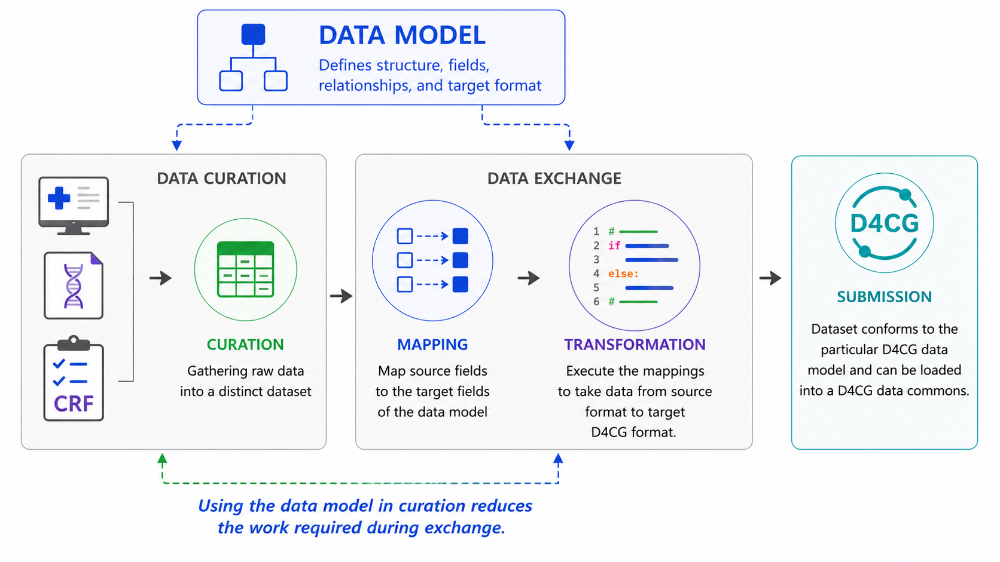

## Data Curation

Most D4CG groups are targeting data <u>that has already been curated</u> through a variety of mechanisms (e.g., clinical trial reporting, registry contribution, individual research projects, etc.). The clinical observations existed natively across EHRs, lab reports, or other source locations, and were then curated into a research dataset. These are most commonly stored in spreadsheets or database tables.

However, some D4CG consortia may decide to pursue data that has not yet been curated and still only exists in native sources. A data model can be used to guide this data curation process and avoid downstream data transformation work.

### Curation via Spreadsheet
D4CG can provide spreadsheet templates, where each class is a sheet, and each variable is a column. Curating data directly into this format makes it submission-ready and removes any need for downstream transformation.

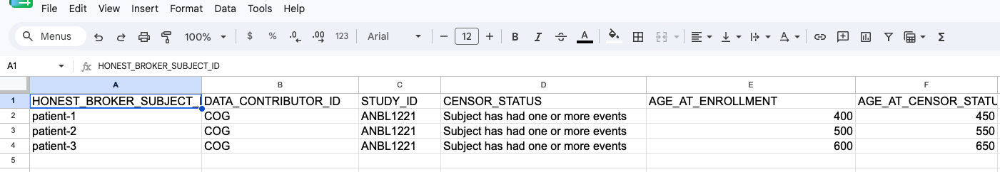

*Custom spreadsheets can also be used for data curation, but these would require subsequent transformation.*

### Curation via REDCap
Designing a REDCap instrument that properly adheres to a D4CG data model is a complex process. However, such an instrument could be shared across consortium partners and is generally user-friendly. 

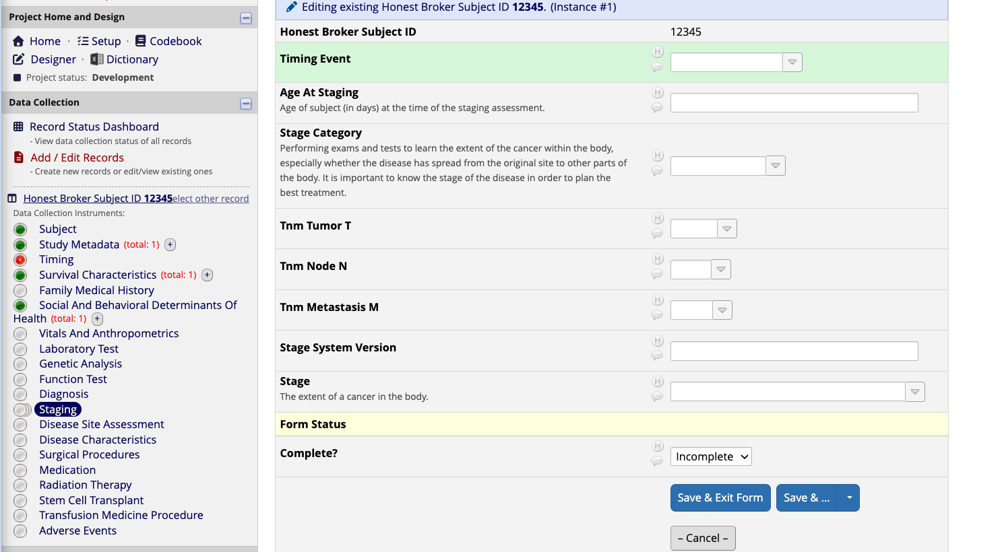

*Instruments that improperly or incompletely adhere to the data model can still be used for data curation, but these would require subsequent transformation.*

### Curation via EHR Cohort Builders
Tools such as Epic SlicerDicer or Epic Registry are useful EHR tools that can be used to build up cohorts of patients who match certain inclusion criteria. The ability to export these patients into spreadsheets and subsequently use them for research initiatives requires careful collaboration with institutional data governance experts.

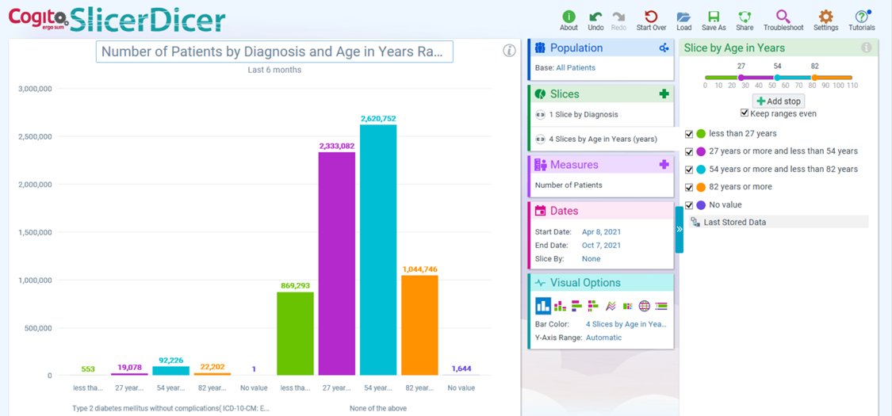

*Cohort building tools such as SlicerDicer use EHR-native data formats, so any exported data would require subsequent transformation*

### Curation via EHR Smart Form
Another option for integrated EHR tooling are smart forms. Once designed, these can be shared across EHR instances. If the form adheres to a D4CG data model, then data curated through these forms are submission-ready upon export.

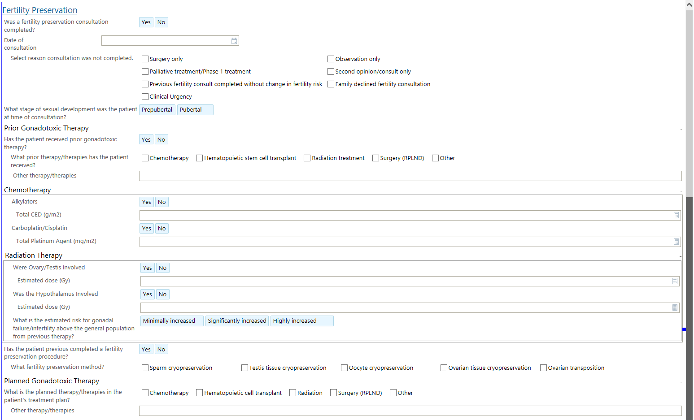

*Instruments that improperly or incompletely adhere to the data model can still be used for data curation, but these would require subsequent transformation.*

| Approach | Pros | Cons |
| --- | --- | --- |
| **Custom Spreadsheet** | Quick to develop; no specialized infrastructure required | No user-interface; loose security; manual entry can introduce errors |
| **REDCap** | Familiar user-interface; some field validation; credentialed access | Complex project design and maintenance; exports may require additional transformation |
| **EHR Cohort Builders** | Familiar user-interface; bulk patient queries; credentialed access | Difficult for nuanced data; dependent on local EHR governance; exports require additional transformation |
| **EHR Smart Forms** | Familiar user-interface; some field validation; credentialed access | Complex development effort; dependent on local EHR governance; exports may require additional transformation |

## Data Exchange

The actual exchange of most data takes only seconds or minutes. However, the *preparation* of that data, so that it conforms to the requirements of the recipient, takes much longer. **Interoperability** is a common word in biomedical informatics, and refers to the compatability of a dataset to be transformed into different data formats for exchange to external parties.

Each D4CG data model represents the required "target" format for submitting a dataset to a D4CG data commons. 

There are a variety of methods for taking a dataset and changing its format. However, at its core, there are two components to this process: mapping and transformation.

### (1) Mapping
Mapping is when fields in a source data set are considered one-by-one and a determination is made as to their corresponding field(s) in the target data model. This process should rely heavily on subject matter expertise to ensure that the integrity of the source data will not be compromised. Typically, these mappings follow the direction of source to target (since there may be target fields that are not used). The mapping types will consist of:

- **One-to-one**: One source field matches one target field (essentially, it is just being renamed).
- **Merge**: Multiple source fields each partially match a single target field.
- **Split**: A single source field partially matches multiple target fields.

The format of these mappings does not need to be standardized and depends on the technical requirements of those doing the data transformation work. However, some examples are included here for context:

*Example: Free-form mappings in a custom spreadsheet*

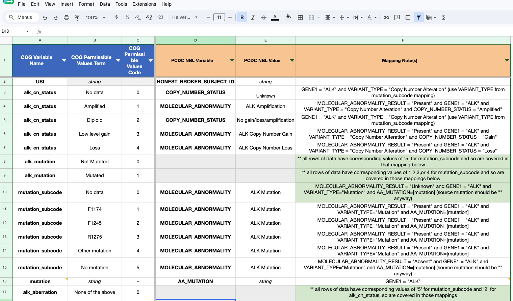

*Example: Standardized mappings written in a computable file*

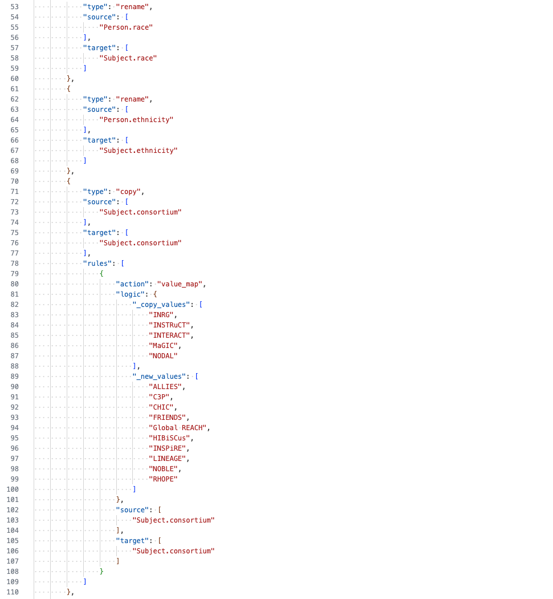

### (2) Transformation

Once it is clear where each source field should end up in the target data model, the actual transformation of the data still must be done. This may be performed using programming languages such as Python, R, SAS, or SQL; spreadsheet tools such as Excel or Power Query; or institutional extract-transform-load tools.

<div class="image-row">
  <figure>
    
    <figcaption>Python</figcaption>
  </figure>

  <figure>
    
    <figcaption>R</figcaption>
  </figure>

  <figure>
    
    <figcaption>SQL</figcaption>
  </figure>

  <figure>
    
    <figcaption>SAS</figcaption>
  </figure>

  <figure>
    
    <figcaption>Excel</figcaption>
  </figure>
</div>

For those without a background in data science, this can be a daunting task. But there are a growing number of resources that can assist in this process. Large language models can help you get started by explaining unfamiliar code, drafting transformation scripts, writing spreadsheet formulas, or troubleshooting errors. However, generated code should always be reviewed, tested on sample records, and validated against the source data before it is used for submission. Patient-level or other sensitive data should not be entered into an unapproved AI tool.

Although D4CG staff are not familiar enough with your particular dataset to do the transformation work, we are available to share best practices and help plan your specific data transformation process.

---

# LinkML Modeling Language

D4CG data models are authored as [LinkML](https://linkml.io/linkml/) schemas. This modeling language is one of many possible formats, but was chosen because of its native support for semantic reasoning and other features. D4CG schemas are maintained in YAML and divided into three modular files. Together, these files constitute a single LinkML schema.

`schema.yaml` contains the overall model structure, including classes and model-level metadata. `slots.yaml` defines the fields used by those classes, and `enums.yaml` defines the controlled permissible values available to enumerated slots.

```
schema.yaml
  ├── model metadata
  ├── classes
  ├── imports slots.yaml
  └── imports enums.yaml

slots.yaml
  └── slots

enums.yaml
  └── enums
        └── permissible values
```

## Classes
Classes are defined in `schema.yaml` and displayed as tables in their rendering on this site. They represent distinct types of observations.

For example, a data submission for the PCDC containing lab values could have *several* instantiations of the <code>LaboratoryTest</code> class. These would be formatted as several rows in a <code>LaboratoryTest</code> sheet of the data submission. The <code>LaboratoryTest</code> class of the PCDC Data Model would dictate what those observations should look like. 

Conversely, a data submission for the PCDC would only contain *one* instance of the <code>Subject</code> class for each patient included in the data submission. Or, in other words, the data submission would only have one row per patient in the <code>Subject</code> sheet of the data submission. 

#### Example

A submission contains one `Subject` row per patient, but multiple `LaboratoryTest` rows per patient.

| honest_broker_subject_id | data_contributor_id | consortium | disease_group | sex | race | ethnicity | efs_censor_status | age_at_censor_status |
| :--- | --- | --- | --- | --- | --- | --- | --- | ---: |
| `PCDC-RMS-1021` | `COG` | `INSTRuCT` | `RMS` | `Female` | `Asian` | `Not Reported` | `Censored` | `4382` |

| honest_broker_subject_id | age_at_lab | laboratory_test | laboratory_test_specimen | result_numeric | laboratory_test_result_unit |
| :--- | ---: | --- | --- | ---: | --- |
| `PCDC-RMS-1021` | `1840` | `Hemoglobin` | `Blood` | `10.4` | `g/dL` |
| `PCDC-RMS-1021` | `1840` | `Platelets` | `Blood` | `172` | `10^9/L` |
| `PCDC-RMS-1021` | `1840` | `WBC` | `Blood` | `4.8` | `10^9/L` |
| `PCDC-RMS-1021` | `1868` | `Creatinine` | `Blood` | `0.6` | `mg/dL` |

Class definitions include which slots (explained below) make up a certain clinical observation, which rules may apply to each class, and other implementation notes to ensure consistent data representation across implementing groups.

## Slots
Slots are defined in `slots.yaml` and represent the fields / variables / attributes that make up the clinical observations represented by each class. Slots can be of the following data types:

| Type | Description | Examples |
|---|---|---|
| <code>string</code> | Free-text | "Other" values, raw test report summaries, etc. |
| <code>decimal</code> | Numeric values that may include a fractional component | Doses, length/volume measurements, lab results, etc. |
| <code>integer</code> | Whole-number values without a fractional component | Age in days, number of nodes, number of tox events, etc. |
| <code>enum</code> | A value selected from a predefined list of permissible values | Diagnoses, sites, response, etc. |
| <code>[class reference]</code> | A reference linking a class to an instance of another class | For modeling purposes only, **not included in contributor data submissions** |

Class-specific rules for a slot are defined through slot_usage within the corresponding class in `schema.yaml`.

## Enums and Permissible Values
Enums are defined in `enums.yaml` and are collections of **permissible values** that constrain the answer options allowed for a variable. Unlike `string`, `integer`, or `decimal` fields, enumerated fields cannot contain arbitrary values—they must match one of the permissible values defined by its enum.

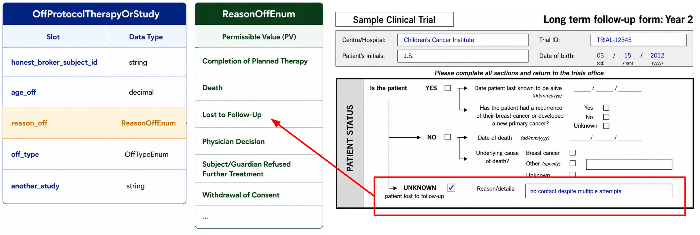

Enums do much of the heavy lifting in data harmonization. This is because free-text is fundamentally **unharmonized**. Requiring data contributors to transform their data not only to a specific structure (classes and slots), but also to shared semantics (enums), ensures that the data can truly be treated as a unified patient cohort.

Using enumerated values improves consistency across contributing institutions, reduces ambiguity, and enables automated validation during data submission. Values that do not match the permissible value list will typically be identified during QA/QC prior to loading into a D4CG data commons.

# Views (Subsets)

Some D4CG data models define **subsets** (called "views" throughout this documentation site) to represent constrained versions of the full data model. A subset specifies which classes, variables, and permissible values are applicable to a particular use case while still remaining compatible with the overall model.

In LinkML, subsets are designated using the `in_subset` field. This field may be applied to:

- **Classes** — to indicate that an entire class belongs to a subset.
- **Slots** — to indicate that a slot / field / variable is included in a subset.
- **Permissible values** — to restrict which values from an enum are valid for a subset.

Not all D4CG data models use subsets. For models that do, such as the PCDC Data Model, every class, variable, and permissible value belongs to the `base` subset unless otherwise specified. Additional subsets then constrain the base model by including only the elements needed for a particular consortium or study.

For example, some PCDC groups may want to capture a patient's response to treatment while others determine that it is out of scope for their research needs. This means that although the concept of subject response must be added to the data model, which is shared by all groups, it can be tagged for inclusion in only the subset of groups who will be using it. 

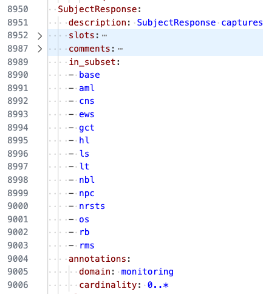

Additionally, although all relevant response criteria must be added to the full data model (e.g., `RECIST`, `Modified McDonald`, `INRC, Brodeur 1993`, etc.), each permissible value in the shared enum can be designated to its appropriate subset (e.g., `RECIST` for many subsets, `Modified McDonald` for CNS tumors, and `INRC, Brodeur 1993` for neuroblastoma.)

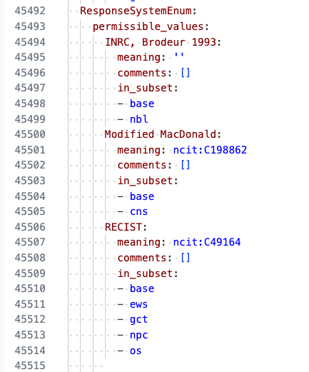

# Identifiers

## De-Identification and HIPAA Compliance

All D4CG models implement Safe Harbor [HIPAA de-identification](https://www.hhs.gov/hipaa/for-professionals/special-topics/de-identification). In particular, they avoid:

* Names
* All geographic subdivisions smaller than a state
* All elements of dates (except year for those under 89 years old) for dates that are directly related to an individual
* Contact information (telephone numbers, email addresses)
* Personal identifiers (social security numbers, medical record numbers, any other unique identifying number)

Generally speaking, dates are translated into `age_at_` variables that give the patient age in days at the time of the event.

## Honest Broker Identifiers
Each patient in a D4CG data commons should be assigned a unique identifier by the data contributor. This identifier serves only to link records belonging to the same individual across the particular data submission and should not contain any protected health information (PHI).

The format of these identifiers is left to the data contributor. They may be numeric, alphanumeric, or follow an institutional naming convention. For example:

- `COG-NBL-1221-PATIENT-0001`
- `SJCRH-AML-004582`
- `PCDC-RMS-100237`

The mapping between these identifiers and the original patient identifiers (e.g., MRN or medical record number) should be maintained only by the contributing institution or designated honest broker and should **never** be included in a D4CG submission.

## Reference Identifiers
While D4CG models are tyically very flat, there are limited instances where observations must reference each other. These class linkages typically take the form of reference identifiers that end with `_submitter_id`. This [naming convention](https://docs.gen3.org/gen3-resources/operator-guide/submit-structured-data/#:~:text=deserve%20special%20mention%3A-,submitter_id,-%3A%20Each%20record%20in) comes from the Gen3 platform which D4CG uses to host all data commons. 

For example, in the PCDC data model, clinical episodes can be defined to represent set time periods during the care of the patient (see [Clinical Episodes](#clinical-episodes)). The `ClinicalEpisode` class includes a slot called `episode_submitter_id`. This is an identifier created for each instance of the class, with the only requirement being that it is unique within the data submission.

The clinical episode, once defined, is intended to be used to group data from other classes and provide a clearer picture of which data occurred during that particular time period. This means that many other classes also include the `episode_submitter_id` slot. By putting the reference identifier defined in the `ClinicalEpisode` class into these other classes, data contributors can link those particular data to appropriate clinical episodes.

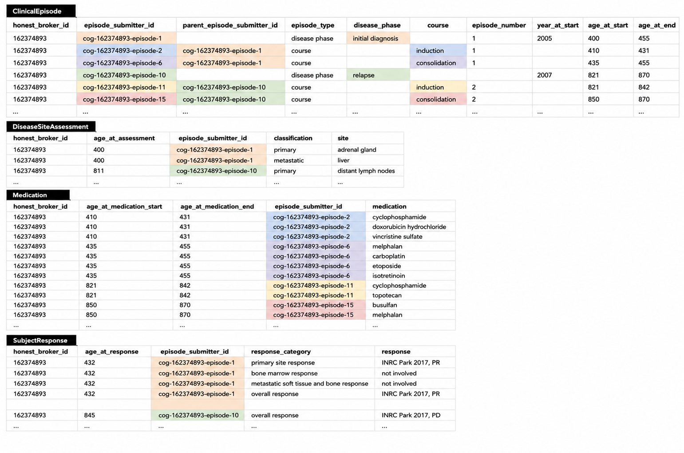

# Clinical Episodes {#clinical-episodes}

Most healthcare is a sequence of distinct periods. Rather than organizing every observation by `age_at` (which is not always reported), D4CG models include pre-defined periods called **clinical episodes**, allowing laboratory results, treatments, assessments, adverse events, and other observations to be associated with the appropriate point in the patient's clinical journey.

Clinical episodes are represented by the `ClinicalEpisode` class. Each row represents **one episode** and is assigned a unique `episode_submitter_id`. Other classes then reference this identifier to indicate which episode an observation belongs to.

Clinical episodes are hierarchical. Broad **disease phases** (such as *Initial Diagnosis* or *Relapse*) can stand alone or as parent episodes to more specific **treatment courses** (such as *Induction*, *Consolidation*, or *Maintenance*) episodes. This allows observations to be grouped at whatever level of detail is appropriate.

```
Initial Diagnosis (disease phase)
├── Induction (course)
├── Consolidation (course)
└── Maintenance (course)

Relapse (disease phase)
├── Induction (course)
├── Maintenance (course)
└── Maintenance (course)
```

Note that treatment courses do **not** repeat disease phase information. Instead, each treatment course references its parent disease phase using `parent_episode_submitter_id`. This avoids redundant data while preserving the complete clinical hierarchy.

For example, consider a patient who completes frontline therapy, later relapses, and subsequently receives two maintenance courses after relapse. The resulting `ClinicalEpisode` observations may look like this:

| episode_submitter_id | parent_episode_submitter_id | episode_type | disease_phase | treatment_course | episode_number | age_at_start | year_at_start |
|---|---|---|---|---|:--:|:--:|:--:|
| EP001 | *\<blank>* | Disease Phase | Initial Diagnosis | *\<blank>* | 1 | 2190 | 2022 |
| EP002 | EP001 | Treatment Course | *\<blank>* | Induction | 1 | 2197 | 2022 |
| EP003 | EP001 | Treatment Course | *\<blank>* | Consolidation | 1 | 2260 | 2022 |
| EP004 | EP001 | Treatment Course | *\<blank>* | Maintenance | 1 | 2380 | 2022 |
| EP005 | *\<blank>* | Disease Phase | Relapse | *\<blank>* | 1 | 2920 | 2024 |
| EP006 | EP005 | Treatment Course | *\<blank>* | Induction | 1 | 2927 | 2024 |
| EP007 | EP005 | Treatment Course | *\<blank>* | Maintenance | 1 | 2990 | 2024 |
| EP008 | EP005 | Treatment Course | *\<blank>* | Maintenance | 2 | 3170 | 2025 |

In this example:

- `EP005` defines the patient's **relapse** disease phase.
- `EP006`, `EP007`, and `EP008` are all treatment courses that belong to that relapse because they reference `EP005` as their parent.
- `EP007` and `EP008` are both maintenance courses. Their `episode_number` values distinguish the first and second maintenance course within the same relapse.
- Clinical observations recorded during the second maintenance course would reference `EP008`, while observations collected during the relapse in general could instead reference `EP005`, depending on the appropriate level of specificity.

This hierarchical approach provides a flexible framework that can accommodate diverse treatment paradigms while allowing data from different institutions to be represented consistently.

# Cardinality, Required Fields, and Tiering

D4CG data models distinguish between **class cardinality** and **slot tiering**. Cardinality describes how many instances of a class are expected, while tiering describes the prioritization that should be given individual slots within those classes.

## Class Cardinality
Cardinality is defined at the class level. It describes the structure of the data rather than the priority of collecting it.

For example, a class with cardinality `0..*` may contain many observations for the same patient, while a class with cardinality `1..1` represents an observation for which exactly one instance is expected per patient.

| Cardinality | Meaning |
| --- | --- |
| **`1..1`** | Exactly one instance is expected for each patient. |
| **`0..1`** | At most one instance may be present for each patient, but it is optional. |
| **`1..*`** | One or more instances are expected for each patient. |
| **`0..*`** | Any number of instances may be present, including none. |


## Slot Requirements and Tiering

Not every variable in a D4CG data model is expected to be available for every patient or every institution. To balance scientific value with practical feasibility, D4CG uses slot-level requirements and subset-specific prioritization to guide data collection and contribution.

| Designation | Meaning | Note |
| --- | --- | --- |
| **Required** | A slot with `required: true` has been designated by D4CG as necessary for proper use and compliance with the model. | Required slots are intentionally rare and generally represent information necessary to make an observation interpretable or valid. |
| **Priority** | A slot with `required: false` may be designated as a priority for one or more model subsets through the `priority` annotation. | Priority fields are strongly encouraged for the listed subsets but are not required for submission. |
| **Optional** | This is the default state. A slot with `required: false` is optional for any subset not listed in its `priority` annotation. | These fields may be submitted whenever available but are not expected from every contributor. |

Consider the example of the LaboratoryTest class, which is used to encode the individual results of a lab test. The name of the test itself, represented by the `laboratory_test` slot, is **required**, since a floating numeric or text result would be meaningless without knowing what the actual test was. The specimen used for the test may also be important to the research interests of a certain disease consortium, however, it's absence would not render the result meaningless, so rather than be marked as required, it is marked as a **priority** for any consortia who desire it.

```yaml
slot_usage:
  laboratory_test:
    required: true

  laboratory_test_specimen:
    required: false
    annotations:
      priority:
        - aml
        - cns
```

Any slot not required, and not designated as a priority for a certain subset, will be assumed to be **optional** to that subset.

# Genetic Data

The modeling of genetic data has consistently been one of the most challenging aspects of implementing a D4CG data model. The most important principle to keep in mind is that the `GeneticAlteration` class is designed to represent **many different types of genetic test results**. This means that no single observation/row will contain values for all of the available slots.

For example, `gene` and the `hgvs_` slots are typically used to report sequence variants identified through gene panels or sequencing assays, whereas `chromosome`, `cytoband`, and `iscn` are more commonly used to report structural abnormalities identified through cytogenetic testing such as karyotyping or FISH.

## Granularity

Each D4CG data commons receive data from a diverse range of institutions whose source data vary considerably due to differences in clinical practice, historical data collection, testing methodologies, and available resources. While highly structured data provide the greatest value for downstream analysis, the data model must also accommodate less granular or partially structured datasets.

To support these use cases, the `GeneticAnalysis` class includes two supplementary slots:

- **`alteration`** — A free-text description of the reported genetic finding (e.g., *ALK Gain*, *BCR::ABL1 fusion*, or *17p Loss*). This field captures the alteration as it appears in the source data when resource are too constrained to transform the result into a fully structured representation.
- **`result_text`** — A de-identified excerpt or interpretation from the original laboratory report. This field preserves clinically meaningful information that cannot reasonably be represented in structured fields.

These fields are intended to **supplement**, not replace, a more structured representation. Whenever sufficient information is available, the appropriate structured fields should be populated. The free-text fields provide a mechanism for preserving information that might otherwise be lost during data harmonization.

#### Low Granularity

<table class="compact">
<thead>
<tr>
<th>alteration_presence</th>
<th>alteration</th>
</tr>
</thead>
<tbody>
<tr>
<td><code>Present</code></td>
<td><code>ALK Gain</code></td>
</tr>
</tbody>
</table>

#### High Granularity

| alteration_presence | alteration | gene | alteration_type | alteration_effect | hgvs_coding | hgvs_protein |
|:--- | :-- | --- | --- | --- | --- | --- |
| `Present` | `ALK Gain` | `ALK` | `Substitution` | `Gain` | `c.3383G>C` | `p.G1128A` |
 
## Alteration Types, Effects, and Regions

Clinical genomic reports frequently use the word *mutation* to describe many different biological concepts. However, these concepts are often describing different aspects of the same observation.

For example:

- **"Deletion mutation"** describes the **type** of alteration.
- **"Frameshift mutation"** describes the **effect** of that alteration.
- **"Promoter mutation"** describes **where** the alteration occurred.

To reduce this ambiguity, the D4CG data model separates these concepts into three independent slots.

| Slot | Describes | Examples |
| --- | --- | --- |
| `alteration_type` | **What happened?** The primary mutational event. | Substitution, Deletion, Insertion, Translocation |
| `alteration_effect` | **What was the result?** The biological consequence of the alteration. | Missense, Frameshift, Gain, Loss, Amplification, Gene Fusion |
| `alteration_region` | **Where did it occur?** The genomic feature or region affected. | Promoter, 5' UTR, 3' UTR, Intronic, Splice Site |

These three fields are complementary rather than mutually exclusive. A single observation may populate one, two, or all three fields depending on the information reported by the laboratory.

### Examples

| Laboratory Description | alteration_type | alteration_effect | alteration_region |
| --- | --- | --- | --- |
| *BRCA2 frameshift deletion* | `Deletion` | `Frameshift` | |
| *TERT promoter mutation* | `Not Reported` | | `Promoter` |
| *TP53 splice site mutation* | `Not Reported` | | `Splice Site` |
| *ALK amplification* | `Not Reported` | `Amplification` | |
| *17p deletion* | `Deletion` | `Loss` | |
| *BCR::ABL1 fusion* | `Rearrangement, NOS` | `Gene Fusion` | |

When available, contributors should report each concept separately rather than combining them in the `alteration` slot. This improves interoperability by distinguishing **how the alteration occurred**, **what consequence it produced**, and **where it occurred**, allowing data from different laboratories and testing methodologies to be harmonized more consistently.

## Examples

Different genetic analysis methods produce different kinds of findings, and each finding uses only the applicable slots within `GeneticAnalysis`. Blank cells indicate that the slot is not applicable to the reported result.

| Example Result | alteration_presence | genetic_analysis_method | gene | chromosome | cytoband | alteration_type | alteration_effect | copy_number | hgvs_coding | hgvs_protein | iscn | gene_fusion_partner | chromosomal_translocation_partner |
| --- | :---: | --- | :---: | :---: | :---: | --- | --- | :---: | --- | --- | --- | :---: | :---: |
| *TP53 p.R248Q* | `Present` | `Sequencing, NGS, Targeted DNA Panel` | `TP53` |  |  | `Substitution` | `Missense` |  | `c.743G>A` | `p.R248Q` |  |  |  |
| *BRCA2 frameshift deletion* | `Present` | `Sequencing, NGS, Targeted DNA Panel` | `BRCA2` |  |  | `Deletion` | `Frameshift` |  | `c.5946delT` | `p.Ser1982ArgfsTer22` |  |  |  |
| *MYCN amplification* | `Present` | `Cytogenetics, FISH` | `MYCN` | `2` | `2p24` | `Not Reported` | `Amplification` | `25` |  |  |  |  |  |
| *17p loss* | `Present` | `Cytogenetics, FISH` |  | `17` | `17p` | `Deletion` | `Loss` | `1` |  |  |  |  |  |
| *BCR::ABL1 fusion* | `Present` | `PCR, RT-PCR` | `BCR` |  |  | `Rearrangement, NOS` | `Gene Fusion` |  |  |  |  | `ABL1` |  |
| *t(11;22)(q24;q12)* | `Present` | `Cytogenetics, Karyotyping` |  | `11` | `11q24` | `Translocation` |  |  |  |  | `t(11;22)(q24;q12)` |  | `22` |
| *Trisomy 8 not detected* | `Absent` | `Cytogenetics, Karyotyping` |  | `8` |  | `Not Reported` | `Trisomy` | `2` |  |  | `46,XX` |  |  |
| *Copy-neutral loss of heterozygosity at 11p15* | `Present` | `Cytogenetics, Microarray, SNP Array` |  | `11` | `11p15` | `Not Reported` | `Copy Neutral Loss of Heterozygosity` | `2` |  |  |  |  |  |

# Missing Values

Many D4CG enumerations include the permissible values `Unknown` and `Not Reported`. These values should be used only when they accurately reflect the source data and should not be used as generic placeholders for empty fields.

| Representation | When to Use |
| :-- | :-- |
| **Empty/Blank Value** | The slot is not relevant to the observation being reported. |
| **Unknown** | The source explicitly reports the value as `Unknown`. |
| **Not Reported** | The slot is relevant, but the source does not provide a value. |

The goal is to preserve the meaning of the original data source rather than making assumptions during data harmonization.

| Scenario | Recommended Value |
| :-- | :-- |
| A FISH result reporting a MYCN amplification has no HGVS expression. | `<blank>` |
| A registry explicitly records the patient's race as "Unknown". | `Unknown` |
| A clinical form includes a tumor grade field, but it was left blank. | `Not Reported` |


When in doubt, contributors should preserve the semantics of the source data. `Unknown` should only be used when the source explicitly records a value as unknown. If a relevant value is simply absent from the source, use `Not Reported`. If the slot does not apply to the observation being reported, leave it blank.

# Change Management

D4CG data models follow a **quarterly release cycle** to provide a predictable schedule for implementing improvements while maintaining stability for data contributors.

## Requesting Changes

Change requests may be submitted at any time throughout the quarter. Typical requests include:

- New variables or classes
- Additional permissible values
- Clarifications to documentation
- Corrections to existing definitions
- Deprecation of obsolete content

Requests are reviewed by the D4CG data modeling team as they are received and queued for the next quarterly release.

Changes that affect only a single disease-specific model are reviewed by D4CG data modeling staff and the appropriate disease working group.

#### PCDC-only
Changes that impact multiple consortia (subsets) are reviewed by the **Change Control Committee**, which includes representatives from the affected disease groups. The committee evaluates proposed changes for consistency, interoperability, and downstream impact before approval.

## Quarterly Releases

At the end of each quarter, all approved changes are incorporated into the canonical LinkML schema maintained in the D4CG GitHub repository.

Each release includes:

- A new **minor version** for the data model (e.g., 2.2 → 2.3)
- A versioned LinkML schema consisting of `schema.yaml`, `slots.yaml`, and `enums.yaml`
- A `terminology.yaml` file containing terminology metadata used by the model documentation
- Release-specific change notes summarizing approved modifications
- Updated documentation generated from the released schema

The D4CG documentation website always defaults to the current release, while maintaining an archive of prior versions. This allows contributors to continue referencing historical versions when working with older submissions while ensuring new implementations use the latest published model.

Because all documentation is generated directly from the released model and terminology files, the published documentation remains synchronized for every release.

# Data Contribution 

Once a consortium has finalized its data modeling work (meetings as a group) it moves into a contribution phase (meetings with D4CG staff and individual contributors). This process is designed to identify issues early, support contributors during transformation, and ensure that submitted data conform to the applicable D4CG model before release.

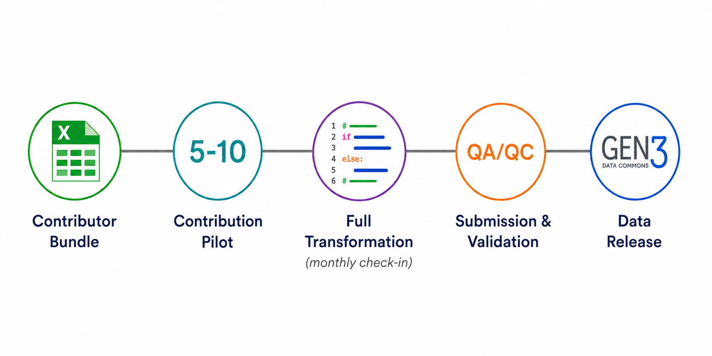

## Contributor Bundle

When a group is ready to begin, D4CG prepares a **contributor bundle** containing:

- Blank spreadsheet templates generated from the applicable model subset
- A data dictionary describing the classes, variables, permissible values, and other submission requirements

These materials define the target format for the contribution.

## Contribution Pilot

Before transforming the full dataset, contributors prepare a small pilot containing approximately **5–10 patients**. D4CG staff review the pilot with the contributor to identify mapping questions, interpretation issues, or model gaps before they are repeated across the full dataset.

The pilot phase may result in:

- Clarification of how source fields map to the model
- Adjustments to the data model
- Correction of formatting issues
- Patient de-identification / identifier issues

## Full Transformation

After the pilot has been reviewed, the contributor performs the full data transformation using their own local tools and resources.

D4CG staff hold monthly check-in meetings during this period to answer questions, review emerging issues, and help the group remain aligned with the target model. Contributors remain responsible for interpreting their source data and completing the transformation.

## Submission and Validation

When the transformation is complete, the submission files are uploaded to a secure Box folder provided by D4CG.

D4CG technical staff then run QA/QC and validation checks, which may include:

- Required-field validation
- Permissible-value validation
- Reference-identifier and class-linkage checks
- Data type and formatting checks
- Internal consistency checks

Any identified issues are returned to the contributor for correction. This review cycle continues until all required validations pass.

## Data Release

Once the submission has passed QA/QC, it is queued for inclusion in the next **quarterly data release**. The validated dataset can then be loaded into the appropriate D4CG data commons and made available according to the consortium's governance and access policies.

# FAQs

### We are ready to expand into relapse data. Where do we start?

Identify the dataset that the consortium wants included in the commons. D4CG staff will then review the existing model with the consortium to determine:

- Which existing classes, slots, and permissible values already support relapse data
- Whether additional model content is needed
- Which fields should be included in the consortium's model subset
- How relapse disease phases and treatment courses should be represented using `ClinicalEpisode`

Any necessary model changes are developed through the standard modeling and change-management process. Once the subset is finalized, D4CG produces an updated contributor bundle and works with the group on a small pilot before full transformation begins.

### How do we request a new field or permissible value?

Submit the request to the D4CG data modeling team with the clinical concept, its intended use, and examples from the source data. The team will determine whether the concept is already represented, whether an existing field can be reused, or whether a model change is needed.

### What should we do when our source field does not match a D4CG field exactly?

Do not force the source data into a field with a different meaning. Document the proposed mapping and discuss it with D4CG staff. The result may require a transformation rule, use of multiple target fields, or a model change.

### Can we submit fields that are not included in our subset?

Contact D4CG before including them. The field may need to be added to the subset through the change-management process so that the submitted data can be validated and loaded consistently.

### Who is responsible for transforming our data?

The contributing group is responsible for mapping and transforming its source data because its members understand the source dataset and its clinical context. D4CG staff provide templates, guidance, pilot review, monthly check-ins, and assistance with implementation questions.

### Why do we begin with only 5–10 patients?

A small pilot makes it possible to identify mapping errors, ambiguous model concepts, formatting problems, and missing model content before those issues are repeated throughout the complete dataset.

### What happens if we discover a model problem during transformation?

Raise the issue during a check-in meeting or contact the D4CG modeling team. Minor clarifications may be resolved directly, while changes to the schema follow the standard quarterly change-management process.

### Can we submit data using an older version of the model?

Contributors should use whichever version was given to them by D4CG staff. If a large amount of time has elapsed since your contributor bundle was provided, and you have not yet begun the transformation work, D4CG staff can provide an updated contriibutor bundle very easily.

The model is constantly updating, but contributors should finish their submission without worrying about those updates and let D4CG coordinate subsequent data migrations.

### Can the same patient be included in more than one contribution?

Potential duplicate or overlapping contributions should be discussed with D4CG before submission. Honest-broker identifiers and contributor metadata are used to preserve linkage while avoiding direct identifiers.